## CS 194-26 Project 3: Face Morphing

In this project, we had to implement the basics of face morphing algorithms, including using Delaunay Triangulation, morphing between faces using point correspondences, computing mean faces and caricatures, and more.

### Defining Correspondences

For this project, I chose to use a photo of myself, and try to morph it into the face of my dad.

<table><tr>
<td> 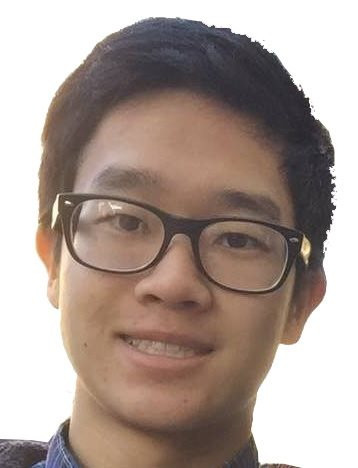 </td>
<td>  </td>
</tr></table>
  
To create the coordinate correspondences, I used a Python script where I would select one point at a time on each image, alternating to make sure that the points I chose corresponded to each other. I then computed the Delaunay triangulation on my own face, and transfered this triangulation over to my dad's face. This gave me the outputs below:

<table><tr>
<td> 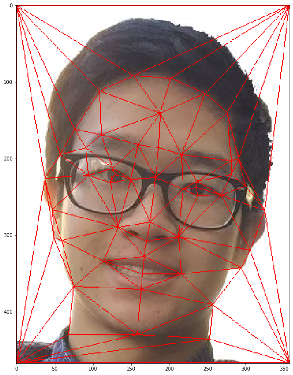 </td>
<td> 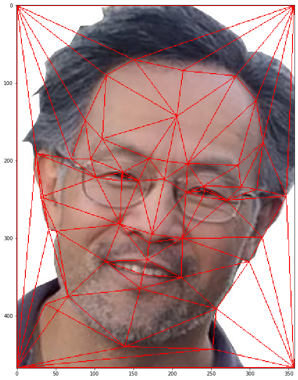 </td>
</tr></table>

There is a deformation on the bottom left if you look at my dad's mesh, but it is probably unavoidable without creating new point correspondences. It is due to the point I chose along my neck, which is thinner / longer than my dad's neck, at least from the perspectives these photos were taken in.

### Computing the "Mid-way Face"

Using these triangulations, some interpolation for the intermediate mesh for coordinate mapping, and inverse-affine mapping for pixel color mapping, we can compute a mid-way face. The one I computed is shown below. 

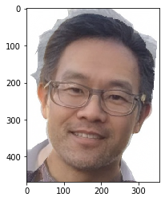

The result is alright. You can see some combination of our features, with his beard and hair fading in, and my darker hair still contributing to how the composite looks younger. The hair part doesn't look great though, since none of our correspondence points besides the corners of the image give any information about our hair shapes.

### The Morph Sequence

The method we used to compute the mid-way face can be used to compute any intermediate face, depending on a percentage parameter we input. This allows us to create a morphing animation, which is shown below.

I think this is pretty cool! In a gif form, the transformation from my hairline to my dad's, as well as from my hairstyle to my dad's seems pretty smooth. The addition of facial hair is also pretty cool to look at.

### The "Mean face" of a Population

For the rest of the project, I used the [Danes](http://www2.imm.dtu.dk/~aam/datasets/datasets.html) dataset. For this and the next part, I used the shots where people looked forwards with a straight face.

From the dataset, I was able to compute an average face mesh, as well as the average face of the dataset. The average face in particular is pretty cool. Even though it's an average, the image is not that blurry, with all the key facial features quite clearly present and normal-looking. In fact, the average face is actually pretty good looking! (Maybe it's just the illusion of smooth skin due to averaging though...)

<table><tr>
<td> 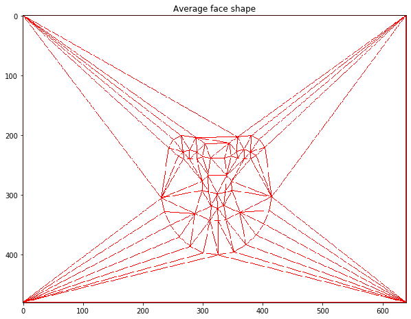 </td>
<td> 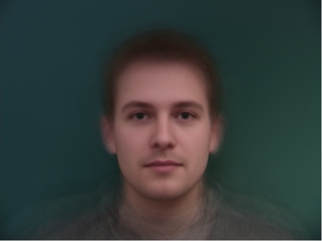 </td>
</tr></table>

With this average face and mesh, we can try to transform our face's structure to the average, and the average face's structure to ours. The results are shown below.

<table><tr>
<td> 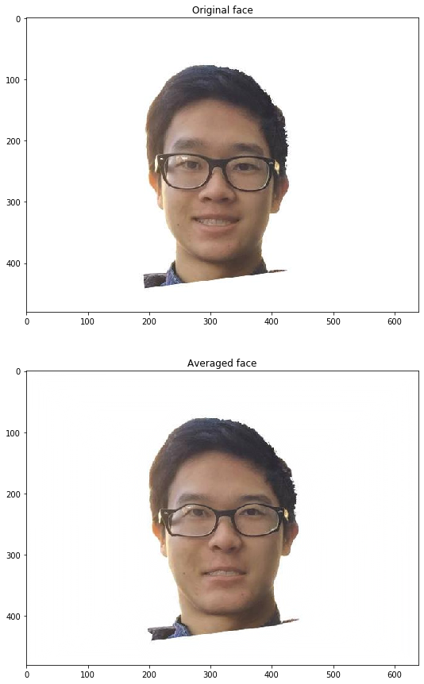 </td>
<td> 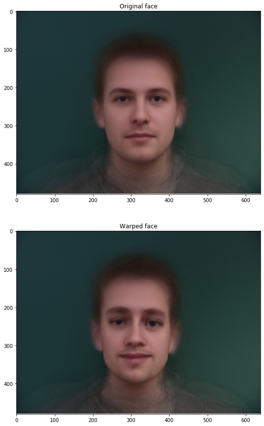 </td>
</tr></table>

For the image of me transformed to the average face, you can see that my mouth is more closed, since the faces in the dataset had mouths closed. My face has also become flatter and wider, and my eyes became closer to my eyebrows. My forehead also became smaller.

If you look at the average faced transformed to my face shape, you see the same effects but reversed: the face is thinner and longer, with a larger forehead and more distance between the eyebrows and the eye. It's also more apparent that my face has a sharper chin than the average of the dataset, as well as bigger eyebrows. Also, you can even see that the average face is now somewhat smiling, which is pretty cool.

### Caricatures: Extrapolating from the mean

Since my face is smiling, whereas the images I averaged from the dataset were not, I figured if I made my face go more in the direction of my face's structure, in the opposite direction from the dataset's average face, I could get a caricature that is smiling more than I already was in the original image. This gave me the following result:

<table><tr>
<td> 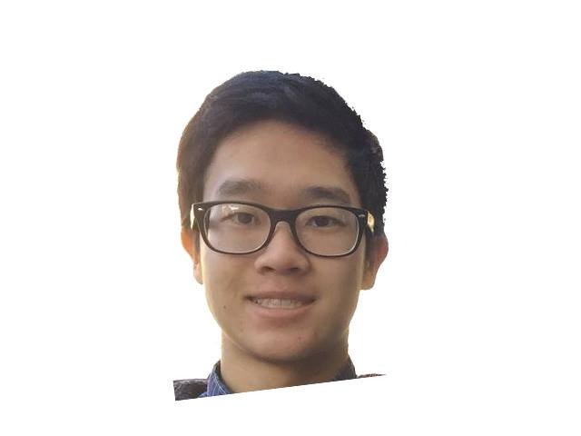 </td>
<td> 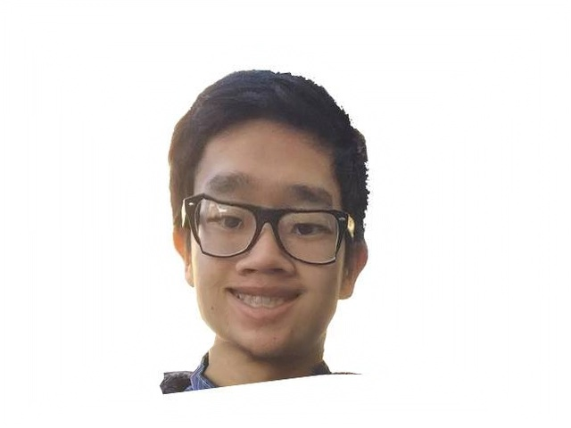 </td>
</tr></table>

It seems to work. Notice that in line with our previous observations, now the caricaturized face has an even thinner face and sharper chin.

### Bells and Whistles
#### Changing face direction

For this section, I still used the Danes dataset, but now I chose to work with the images with people facing towards their right (our left). The goal was to try and get my face to look like it's looking the same way.

As with before, I computed the average mesh, which looked like this:

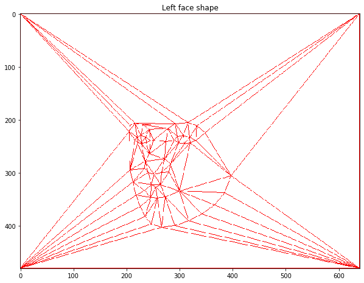

Since the correspondence points were in the same order, I could reuse prior work, and just compute a warped image of my face. However the result, as shown below, was not great. 

<table><tr>
<td> 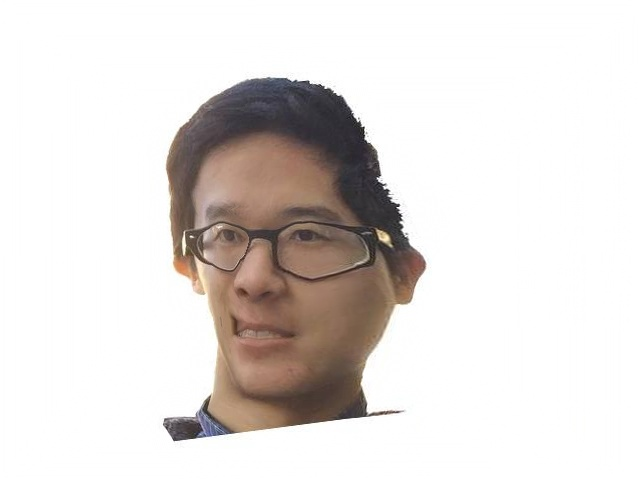 </td>
<td> 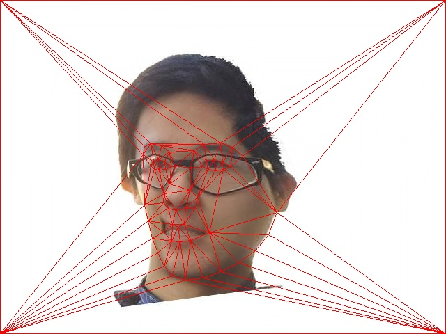 </td>
</tr></table>

However, we can see the problem once we overlay the mesh: as with when computing the midway face of my dad and me, the issue is that there are no correspondence points along the outside of the hair. In fact, there aren't even any above the eyebrows. Because of this, our warp does not behave well with respect to the forehead and hair. Below the chin is not great either. So, if we just crop the image down to where our triangular mesh is good, we can see our result is slightly more palatable.

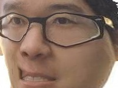

The result is not amazing, by any means, but I certainly look like I'm looking to my right (viewer's left) now. In fact, if I weren't smiling with teeth in this image, and didn't wear glasses, I can imagine that this perspective warp would have looked pretty decent!
