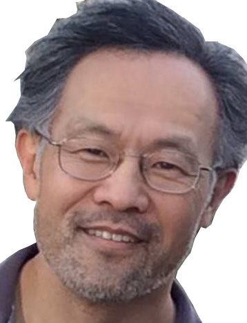

## CS 194-26 Project 3: Face Morphing

In this project, we had to implement the basics of face morphing algorithms, including using Delaunay Triangulation, morphing between faces using point correspondences, computing mean faces and caricatures, and more.

### Defining Correspondences

For this project, I chose to use a photo of myself, and try to morph it into the face of my dad.

<table><tr>
<td>  </td>
<td>  </td>
</tr></table>
  
To create the coordinate correspondences, I used a Python script where I would select one point at a time on each image, alternating to make sure that the points I chose corresponded to each other. I then computed the Delaunay triangulation on my own face, and transfered this triangulation over to my dad's face. This gave me the outputs below:

<table><tr>
<td>  </td>
<td>  </td>
</tr></table>

There is a deformation on the bottom left if you look at my dad's mesh, but it is probably unavoidable without creating new point correspondences. It is due to the point I chose along my neck, which is thinner / longer than my dad's neck, at least from the perspectives these photos were taken in.

### Computing the "Mid-way Face"

Using these triangulations, some interpolation for the intermediate mesh for coordinate mapping, and inverse-affine mapping for pixel color mapping, we can compute a mid-way face. The one I computed is shown below. 

The result is alright. You can see some combination of our features, with his beard and hair fading in, and my darker hair still contributing to how the composite looks younger. The hair part doesn't look great though, since none of our correspondence points besides the corners of the image give any information about our hair shapes.

### The Morph Sequence

The method we used to compute the mid-way face can be used to compute any intermediate face, depending on a percentage parameter we input. This allows us to create a morphing animation, which is shown below.

I think this is pretty cool! In a gif form, the transformation from my hairline to my dad's, as well as from my hairstyle to my dad's seems pretty smooth. The addition of facial hair is also pretty cool to look at.

### The "Mean face" of a Population

### Caricatures: Extrapolating from the mean

### Bells and Whistles
#### Changing face direction

